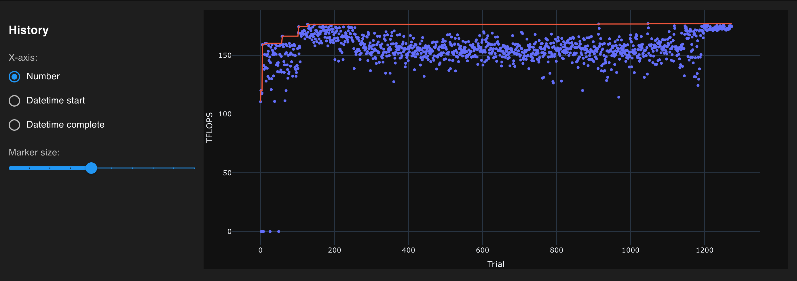
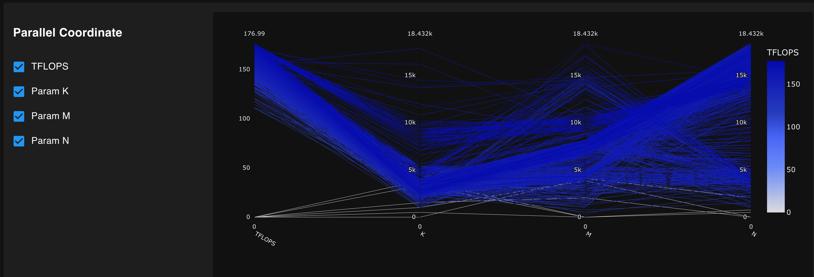

# Theoretical TFLOPS ≠ Real-world Performance
# Testing Theoretical Maximum FLOPS on GPUs

This project aims to measure the theoretical maximum FLOPS (Floating Point Operations Per Second) achievable on various GPU models. Please see the original work by [Stas Bekman](https://github.com/stas00/ml-engineering/tree/master/compute/accelerator#maximum-achievable-flops).

## Key Features

1. **Optimized Search**: Unlike the [original implementation](https://github.com/stas00/ml-engineering/blob/master/compute/accelerator/benchmarks/mamf-finder.py) which uses a brute force approach, this version leverages Optuna for efficient parameter optimization.

2. **Visualization**: Optuna provides insightful visualizations of the optimization process:

   
   

3. **Data Collection**: An optional feature allows submitting results to a remote API for data collection and analysis.


# Stats

| GPU Model | Best Shape (MxNxK) | TFLOPS |
|-----------|---------------------|--------|
| NVIDIA RTX 4000 SFF Ada Generation | 2304x5120x1536 | 59.0 |
| NVIDIA RTX 4000 Ada Generation | 14464x5312x20480 | 82.7 |
| NVIDIA L4 | 1024x6016x1792 | 91.4 |
| NVIDIA RTX A5000 | 17856x17024x3584 | 93.9 |
| NVIDIA RTX A6000 | 9856x12480x13248 | 131.2 |
| NVIDIA L40 | 3712x2624x11136 | 170.3 |
| NVIDIA GeForce RTX 4090 | 14336x4096x4096 | 178.8 |
| NVIDIA L40S | 4416x3776x3072 | 252.0 |
| NVIDIA RTX 6000 Ada Generation | 2624x5632x3328 | 278.5 |
| NVIDIA A100 PCIe | 2304x5120x1536 | 256.4 |
| NVIDIA A100 SXM | 6912x16384x2048 | 267.9 |
| NVIDIA H100 NVL* | 2560x2176x8192 | 488.5 |
| NVIDIA H100 PCIe | 6912x16384x2048 | 499.5 |
| AMD MI300X | 4352x13568x3840 | 758.3 |
| NVIDIA H100 SXM 96GB | 16896x15680x1024 | 807.1 |
| NVIDIA H100 SXM 80GB | 6144x17920x2816 | 821.2 |
| NVIDIA GH200 96GB | 7616x17664x4480 | 852.5 |
| NVIDIA GH200 144G HBM3e | 7616x17664x4480 | 853.8 |

*for H100 NVL we are only using a single card as we don't support multi-gpu

# Install

```
# For a faster and smoother installation experience, we recommend using `uv`, an extremely fast Python package installer written in Rust.
# It's a seamless drop-in replacement for pip, so you don't have to worry about compatibility.
# You can easily install it with: 
pip install uv
git clone https://github.com/mag-/gpu_benchmark
cd gpu_benchmark
uv venv
source .venv/bin/activate
uv pip install -r requirements.txt
./mamf-finder.py
```

# TODO:
- Change benchmarking logic, see discussion here: [https://github.com/mag-/gpu_benchmark/discussions/1]
- check raw CUDA
- check tinygrad

# Acknowledgements:
Thanks to Bernhard from GPTshop.ai for giving me access to GH200

Special thanks to [Stas Bekman](https://x.com/StasBekman) for the original implementation and research.
